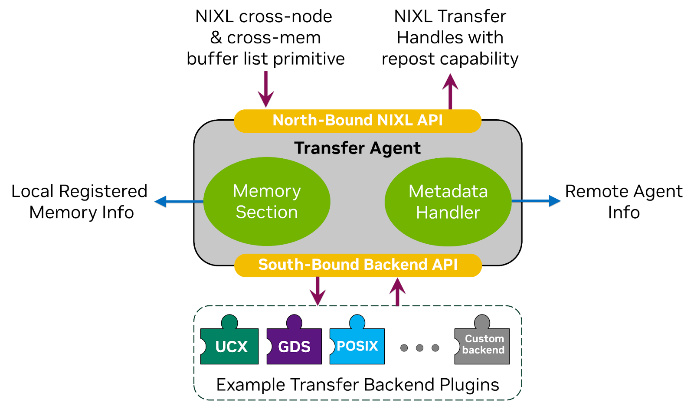
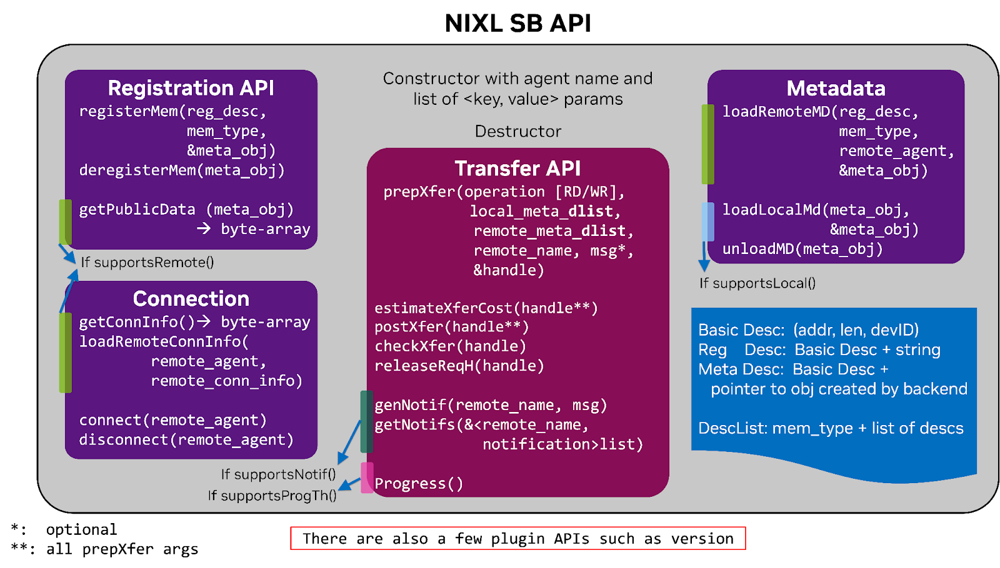
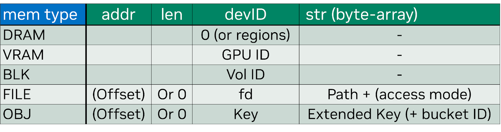

<!--
SPDX-FileCopyrightText: Copyright (c) 2024-2025 NVIDIA CORPORATION & AFFILIATES. All rights reserved.
SPDX-License-Identifier: Apache-2.0

Licensed under the Apache License, Version 2.0 (the "License");
you may not use this file except in compliance with the License.
You may obtain a copy of the License at

http://www.apache.org/licenses/LICENSE-2.0

Unless required by applicable law or agreed to in writing, software
distributed under the License is distributed on an "AS IS" BASIS,
WITHOUT WARRANTIES OR CONDITIONS OF ANY KIND, either express or implied.
See the License for the specific language governing permissions and
limitations under the License.
-->

# NIXL Backend Plugin Interface Overview

NIXL (NVIDIA Inference Xfer Library) is designed to provide high bandwidth, low-latency communication for distributed inference workloads, such as efficient data transfers in scenarios like LLM serving. The library abstracts communication mechanisms and memory access across heterogeneous devices including CPUs, GPUs, and various storage types. This abstraction is presented to the user of NIXL library as its North Bound API (NB API), where they can express transfers requests to NIXL agent through its simple buffer list primitive, and after creation of a request, start the transfer in a non-blocking and asynchronous manner. NIXL delegates the transfer to the optimal backend plugin, resulting in seamless data movement at Speed of Light (SOL) across heterogeneous memory and storage systems.

This is achieved through the South Bound API (SB API) that serves as the standardized interface between NIXL's Transfer Agent and various backend plugins. NIXL agent handles bookkeeping for the local registered memories with backend plugins, as well as managing the required metadata for one-sided transfers, i.e., Read and Write operations, for local or remote transfers. The following diagram further illustrates these components:

Each backend can have unique characteristics and features – for example, UCX is a high-performance communication library, which performs data movement between system and/or GPU memories, while GPUDirect Storage (GDS) can move data between storage disks and GPU memory. To manage a multitude of these transports and ensure the dynamicity of NIXL, the libraries need to be loaded on-demand based on the transport requirement of inference apps. This additional set of APIs for the on-demand requirement, along with the SB APIs, is required to be implemented by a library to be pluggable to NIXL, and hence be called a NIXL Plugin.

Note that plugin implementation is in C++ to achieve SOL, and the header files for the backend plugin can be found in [the backend directory.](https://github.com/ai-dynamo/nixl/tree/main/src/api/cpp/backend)

# The Plugin Architecture and Implementation Overview

NIXL implements a modular plugin architecture where each backend is encapsulated within a library that exposes its features through the SB API, such as [UCX](https://github.com/ai-dynamo/nixl/tree/main/src/plugins/ucx), [GPUDirect Storage (GDS)](https://github.com/ai-dynamo/nixl/tree/main/src/plugins/cuda_gds), or any other custom implementation. The Plugin Manager component within NIXL handles discovery, loading, and instantiation of backend plugins, whether they are dynamically loaded or statically built into the NIXL library. Each plugin needs to implement the SB API, as well as a few methods for the plugin manager, which are discussed in the following sections.

Note that some of the methods in the SB API are not necessary to be implemented, for instance if a backend does not support notifications, it can indicate it through supportsNotif() method, and if it returns false, the agent will not send requests with notifications to this backend. There are 4 such capability indicators, which are detailed further and which APIs are required to be implemented for each of them.

## The South Bound API

For a backend to be compatible with NIXL, it must implement several key SB API methods including:

### Constructor and Destructor:

* Constructor: A key/value set of parameters alongside Agent name is passed to the backend.
* Destructor: Release the remaining resources.

### Capability Indicators:

* supportsLocal(): Indicates if the backend supports transfers within a node
* supportsRemote(): Indicates if the backend supports transfers across nodes
* supportsNotif(): Indicates if the backend supports notifications
* supportsProgressThread(): Indicates if the backend requires calls to a progress method, potentially in a separate thread
* getSupportedMems(): Indicates memory types supported by the backend

Based on the first 4 methods (supports*), the required methods to be implemented change. For instance, UCX backend implements all as it supports all scenarios, while GDS backend only has supportsLocal, detailed more in Example implementations. Note that a network backend should have supportsRemote and supportsNotif to be set to true, and preferably supportsLocal also to true, so another backend doesn’t need to be involved for local transfers. For a storage backend, it should have supportsLocal and supportsNotif is optional. supportsProgressThread is optional for both cases.

### Connection Management:

* connect(): Initiates connection to a remote agent.
* disconnect(): Terminates connection with a remote agent
* getConnInfo(): Provides connection information in form of a serialized byte array for remote agents
* loadRemoteConnInfo(): Loads connection information (byte array) received from a remote agent

Some backends require a self connection for loopback, so connect and disconnect is always required, as a backend either supports local or remote communication, or both. However, getConnInfo and loadRemoteConnInfo are required only if supportsRemote is set.

Note that loadRemoteConnInfo does not initiate the connection, if the user wants to pre-establish the connection before the first transfer, there will be a call to the connect method. Another option when connect is called is when the backend has supportsLocal and a connection to the agent itself is called right after instantiation. During the time of the first transfer to an agent, if the connection was not pre-established, the backend should make the connection, either in prepXfer() or postXfer().

### Memory Management:

* registerMem(): Registers memory regions with the backend. Only a single contiguous memory descriptor, alongside the type of memory space is passed.
* deregisterMem(): Deregisters memory regions

Each backend inherits from nixlBackendMD base class to store any metadata required per registration. A pointer to an object of this class will be the output of registerMem, and the only input to deregisterMem.

### Metadata Management:

* getPublicData(): Provide a serialized byte array for remote identifier for a registered memory
* loadRemoteMD(): Loads a remote byte array received from a remote agent
* loadLocalMD(): Loads local memory metadata, directly from local metadata object
* unloadMD(): Releases resources for remote identifier metadata object

Similar to registration, each backend can make a class that inherits from nixlBackendMD to store remote identifiers in a deserialized form from the byte array, achieved by loadRemoteMD. For case of local transfers, the serialization/deserialization part is skipped, so loadLocalMD generates a pointer to an object for the remote identifier, or can output the input pointer for the registered memory.

getPublicData and loadRemoteMD are required if backend supportsRemote, and loadLocalMD is required if backend supportsLocal, and unloadMD is required in all cases to release the deserialized remote identifier object.

### Transfer Operations:

* prepXfer(): Given a descriptor list on each side, read or write operation, and remote agent name (can be loopback to itself if supported), any preparation for a transfer can be performed here, generating a pointer nixlBackendReqH that is a base class to be inherited by the backend for storing state of transfer request.
* estimateXferCost: Given the same info as prepXfer, as well as the transfer request output from prepXfer, the backend can estimate the time of transfer, with noise margin and method of estimation. This is optional.
* postXfer(): Posts a transfer request, meaning the backend should start the transfer. This call is asynchronous, meaning it should not wait to finish the transfer. If the transfer is really small, it’s fine to return DONE right after this call.
* checkXfer(): Checks the status of a transfer request.
* releaseReqH(): Releases a transfer request handle.

Within each transfer request, a descriptor list is passed, if there is room for parallelization across different contiguous memory locations, such as across different GPUs (one transfer can expand multiple GPUs). Optionally the user might ask for a notification, which should be sent after all the descriptors within a transfer request are sent. If a backend does not set supportsNotifications, no such notification will be asked.

Note that any transfer request will be prepped only once, but can be posted multiple times, as long as it gets to DONE state before getting reposted. There is no ordering guarantee across transfer requests, and no locking mechanism for any specific memory region; the user is in charge of not corrupting the memory by having two simultaneous transfers to the same location.

### Notification Handling:

* getNotifs(): Gets notifications received from remote agents (or local in case of loopback). The output is a map from remote agent name to a list (vector) of notifications, in the form of byte array.
* genNotif(): Generates a notification to a remote agent, used for control or dummy notifications.

Note that getNotif does not know which agent it should look for to receive the notification. So there should be a method to extract the agent name from the notification received, corresponding to a transfer. genNotif generates a notification which is not bound to any transfers, and does not provide any ordering guarantees. If a backend does not set supportsNotifications, these two methods are not needed.

### Progress Thread:

* progress(): Makes progress on transfers and notifications.

If a backend requires a progress call, such as UCX, to proceed with the transfers, for both check of transfer status or received notification, they can implement a progress thread, and a frequency of waking up that thread will be passed during backend creation. In addition, each time a user calls to check a transfer status, or check received notifications, this method is called, enabling progress if a progress thread is not implemented.

## Descriptor List Abstraction

A key underlying abstraction for NIXL library is a descriptor list, that is made of a memory space (host/GPU/block/File/Obj-Store) and a list of descriptors. There are 2 types of descriptors used for the SB API.

*For transfers: (addr, len, devID, metadata), where metadata is a pointer to an nixlBackendMD object relevant to the registered memory that this descriptor falls within.
*For registration, (addr, len, devID, str) where str is an optional byte-array for extra information. The table below shows the meaning of devID for different memory spaces, as well as optional meaning for File and Object-Store.

## Plugin Manager API

From a user perspective talking to the NIXL agent, the type of backend transport is selected, e.g., “UCX” or “GDS”, and NIXL will take care to search for the appropriate plugin, load it into memory, and then create an instance of that backend engine which supports the SB APIs. Within NIXL, there is a main component called the ‘Plugin Manager’ that handles the active discovery, loading, unloading, instance creation of various plugins. When the NIXL library is loaded, the Plugin Manager will read pre-known or configurable directories where NIXL plugins can be present. It then proceeds to verify that the plugin conforms to the set of NIXL APIs by finding dynamically loaded symbols in that library. If these requirements are satisfied, then the Plugin Manager keeps the plugin in memory for the duration of the application. In addition to the southbound API, a plugin needs to implement these methods for the plugin manager:

* get_plugin_name: Returns the name of the backend plugin
* get_plugin_version: Returns the current version of the plugin
* create_engine: Returns an instance of the backend engine
* destroy_engine: Destroys the engine instance
* get_backend_mems: Returns the supported memory types by this backend
* get_backend_options: Returns configuration options and parameters that the plugin can use during initialization. The user can use this information to know such parameters during runtime, and across different versions of the plugin.

The plugin manager maintains API versioning of these above APIs. This can allow NIXL to ensure backward/forward compatibility for many more plugins. Furthermore, there can be both static and dynamic plugins, meaning being auto-loaded and/or built-in into the NIXL library directly or being loaded from disk on-demand respectively. Static plugins can provide slightly better performance at the expense of a larger application size. The API for both options are the same.

## Comparing two plugins as an example

NIXL UCX plugin provides networking across different nodes, while GDS plugin provides storage access. Moreover, UCX plugin sets all of the “supports” flags, while GDS only has the supportsLocal flag set. The reason being UCX requires a progress thread and provides notifications, and can do transfers within an Agent, for instance from GPU to CPU, and across Agents. Therefore, it should implement all of the methods mentioned previously.

However, for NIXL storage backends, there is no need to run a NIXL agent on a remote storage node. Instead, a distributed storage client on the local agent talks to the remote distributed storage, and therefore from NIXL agent point of view for all storage, whether local or remote, it has to talk to this local storage client. In other words, all the transfers are loopback to the agent itself. For the current use case, there is no need for notifications within the same agent, or a progress thread either.

Moreover, the GDS plugin does not require a local connection to itself, so it returns SUCCESS for connect and disconnect, and for loadLocal simply returns back the input pointer as its output. The only 6 remaining methods that it has to implement are:

* registerMem
* deregisterMem
* prepXfer
* postXfer
* checkXfer
* releaseReqH.