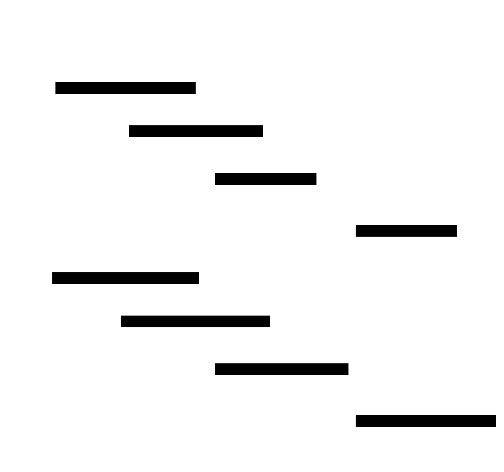
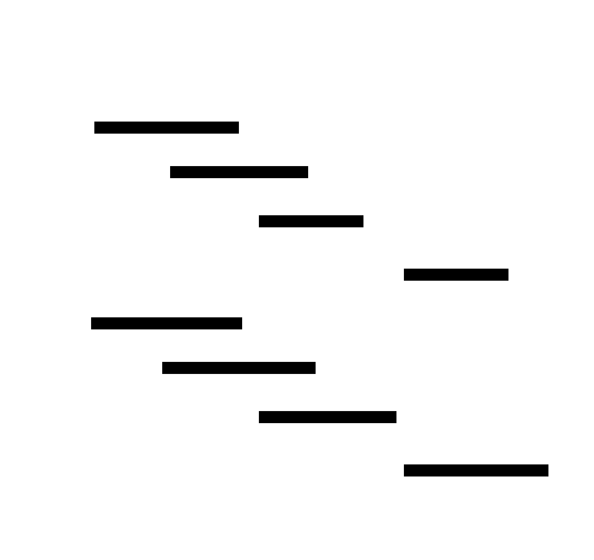
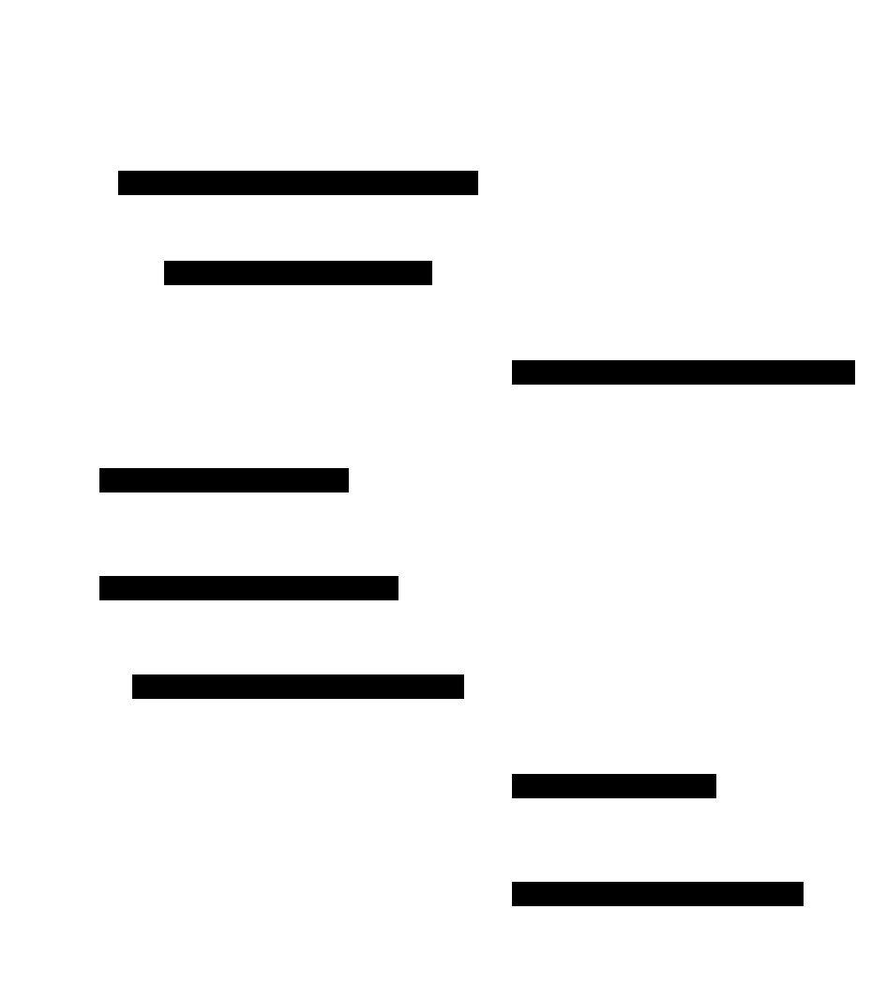
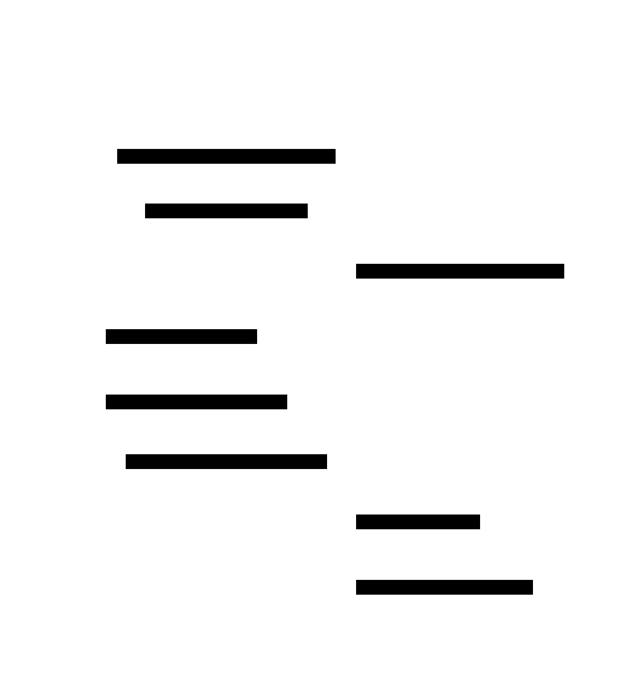
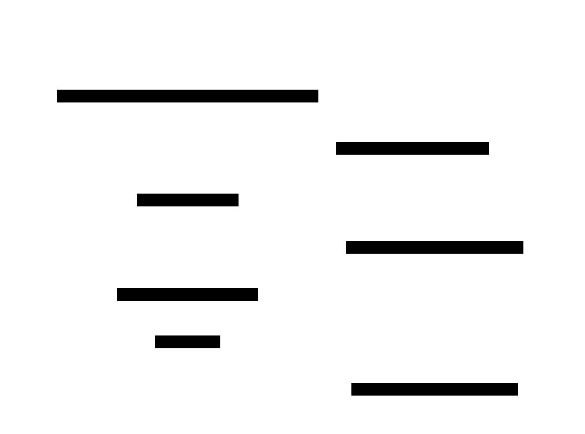
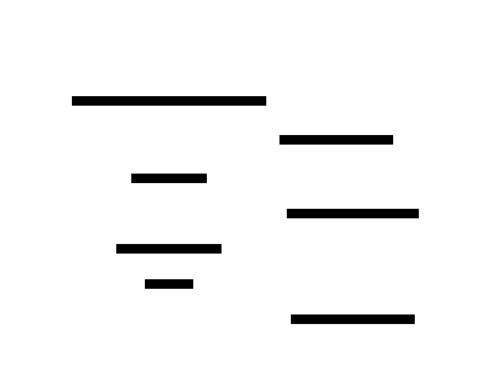
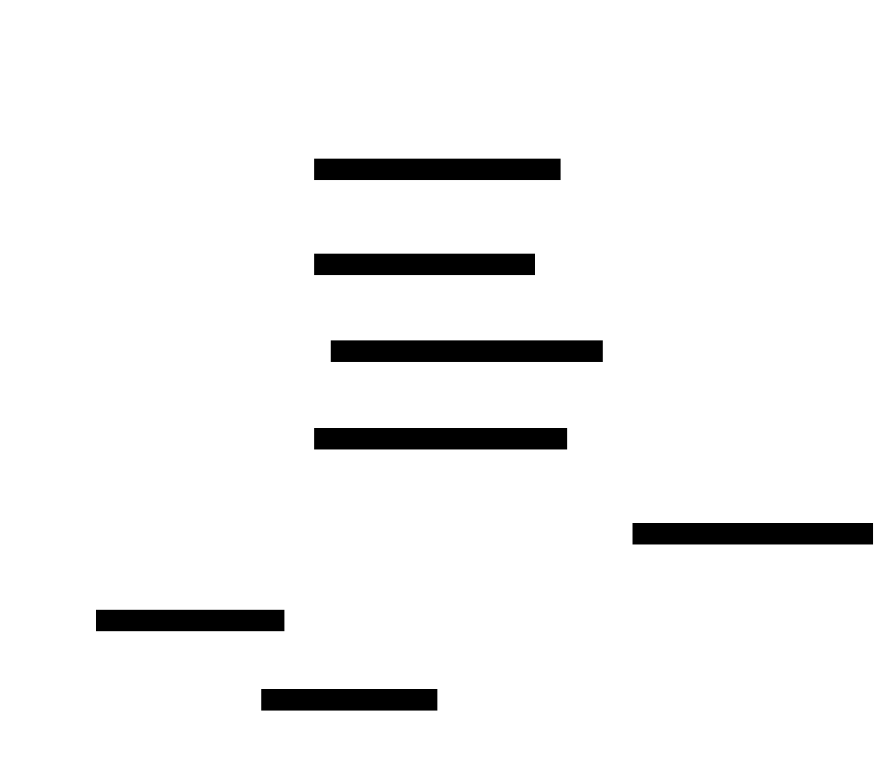
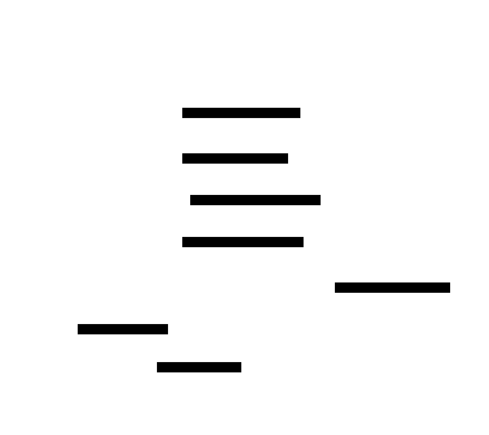

The examples below are taken from the `examples/` directory in the [NIXL repository](https://github.com/ai-dynamo/nixl), annotated with inline explanations. For the conceptual overview of NIXL's transfer workflow, see [Quick Start](../getting-started/quick-start).

**What you'll learn:** How to create two Transfer Agents, register memory regions, exchange metadata via a side channel, and execute an asynchronous data transfer between them.

This example runs two agents in the same process (or across two processes/machines) and performs a data transfer using the UCX backend. The workflow follows the standard NIXL lifecycle: create agents, register memory, exchange metadata, execute transfer, verify, and tear down.

The four phases below -- initialization, metadata exchange, transfer, and teardown -- cover the complete two-peer transfer lifecycle. Each phase includes a sequence diagram followed by a code walkthrough.

### Initialization

<div className="diagram-light">
<Frame caption="Phase 1: Initialization">

</Frame>
</div>
<div className="diagram-dark">
<Frame caption="Phase 1: Initialization">

</Frame>
</div>

Both agents are created with configuration for progress threads and notifications. The target holds source data (ones), while the initiator starts empty (zeros). Both register their memory regions with NIXL so the UCX backend can pin them for RDMA.

### Metadata & Descriptor Exchange

<div className="diagram-light">
<Frame caption="Phase 2: Metadata & Descriptor Exchange">

</Frame>
</div>
<div className="diagram-dark">
<Frame caption="Phase 2: Metadata & Descriptor Exchange">

</Frame>
</div>

The initiator fetches the target's metadata via direct TCP, then the target serializes its transfer descriptors and sends them to the initiator using NIXL's notification system. The initiator polls for and deserializes the received descriptors.

### Transfer Execution

<div className="diagram-light">
<Frame caption="Phase 3: Transfer Execution">

</Frame>
</div>
<div className="diagram-dark">
<Frame caption="Phase 3: Transfer Execution">

</Frame>
</div>

The initiator creates a READ transfer request to pull data from the target's tensor. The transfer is posted asynchronously and the initiator polls for completion. On success, a "Done_reading" notification is sent to the target.

### Teardown

<div className="diagram-light">
<Frame caption="Phase 4: Teardown">

</Frame>
</div>
<div className="diagram-dark">
<Frame caption="Phase 4: Teardown">

</Frame>
</div>

The initiator removes the remote agent reference, releases the transfer handle, and invalidates metadata. Both agents deregister their memory regions and are destroyed.

### Code

<CodeBlocks>
```python title="Python"
import torch
from nixl._api import nixl_agent, nixl_agent_config

# Step 1: Configure and create two agents
# enable_prog_thread=True enables the progress thread for async transfers
# enable_notifs=True enables notification support between agents
# listen_port sets the port for the target agent (0 = auto-assign for initiator)
target_config = nixl_agent_config(True, True, 5555)
initiator_config = nixl_agent_config(True, True, 0)

target_agent = nixl_agent("target", target_config)
initiator_agent = nixl_agent("initiator", initiator_config)

# Step 2: Allocate memory and register with NIXL
# The target has data (ones), the initiator starts empty (zeros)
torch.set_default_device("cpu")
target_tensor = torch.ones((10, 16), dtype=torch.float32)
initiator_tensor = torch.zeros((10, 16), dtype=torch.float32)

# register_memory tells NIXL about the memory regions so they can be
# used in transfers -- the backend pins/registers them as needed
target_reg = target_agent.register_memory(target_tensor)
initiator_reg = initiator_agent.register_memory(initiator_tensor)

# Step 3: Create transfer descriptors from tensor rows
# Each row becomes a separate transfer descriptor
target_rows = [target_tensor[i, :] for i in range(target_tensor.shape[0])]
target_descs = target_agent.get_xfer_descs(target_rows)
target_desc_str = target_agent.get_serialized_descs(target_descs)

initiator_rows = [initiator_tensor[i, :] for i in range(initiator_tensor.shape[0])]
initiator_descs = initiator_agent.get_xfer_descs(initiator_rows)

# Step 4: Exchange metadata between agents
# In a real deployment, agents run on different machines and exchange
# metadata over the network (TCP, ETCD, etc.)
initiator_agent.fetch_remote_metadata("target", "127.0.0.1", 5555)
initiator_agent.send_local_metadata("127.0.0.1", 5555)

# Wait for the target's metadata to be available
ready = False
while not ready:
    ready = initiator_agent.check_remote_metadata("target")

# The target sends its descriptors to the initiator via notification
target_agent.send_notif("initiator", target_desc_str)

# Initiator receives the target's descriptors
notifs = initiator_agent.get_new_notifs()
while len(notifs) == 0:
    notifs = initiator_agent.get_new_notifs()
target_descs = initiator_agent.deserialize_descs(notifs["target"][0])

# Step 5: Create and post the transfer request
# READ means the initiator reads data FROM the target
# "Done_reading" is a notification sent to the target when complete
xfer_handle = initiator_agent.initialize_xfer(
    "READ", initiator_descs, target_descs, "target", "Done_reading"
)

# Step 6: Execute the transfer and poll for completion
state = initiator_agent.transfer(xfer_handle)

while True:
    state = initiator_agent.check_xfer_state(xfer_handle)
    if state == "ERR":
        raise RuntimeError("Transfer failed")
    elif state == "DONE":
        break

# Step 7: Verify the data was transferred correctly
assert torch.allclose(initiator_tensor, torch.ones((10, 16)))

# Step 8: Clean up resources
initiator_agent.remove_remote_agent("target")
initiator_agent.release_xfer_handle(xfer_handle)
initiator_agent.invalidate_local_metadata("127.0.0.1", 5555)
initiator_agent.deregister_memory(initiator_reg)
target_agent.deregister_memory(target_reg)
```

```cpp title="C++"
#include <iostream>
#include <cstring>
#include "nixl.h"

int main() {
    // Step 1: Create two agents with progress threads enabled
    nixlAgentConfig cfg;
    cfg.useProgThread = true;

    nixlAgent A1("Agent001", cfg);
    nixlAgent A2("Agent002", cfg);

    // Step 2: Create UCX backends for both agents
    nixl_b_params_t init1, init2;
    nixl_mem_list_t mems1, mems2;

    A1.getPluginParams("UCX", mems1, init1);
    A2.getPluginParams("UCX", mems2, init2);

    nixlBackendH *bknd1, *bknd2;
    A1.createBackend("UCX", init1, bknd1);
    A2.createBackend("UCX", init2, bknd2);

    nixl_opt_args_t extra_params1, extra_params2;
    extra_params1.backends.push_back(bknd1);
    extra_params2.backends.push_back(bknd2);

    // Step 3: Allocate memory and register with NIXL
    // Agent1 has source data (0xbb), Agent2 has empty destination (0x00)
    nixl_reg_dlist_t dlist1(DRAM_SEG), dlist2(DRAM_SEG);
    size_t len = 256;
    void* addr1 = calloc(1, len);
    void* addr2 = calloc(1, len);

    memset(addr1, 0xbb, len);
    memset(addr2, 0, len);

    // Create descriptors pointing to the allocated buffers
    nixlBlobDesc buff1, buff2;
    buff1.addr = (uintptr_t)addr1;
    buff1.len = len;
    buff1.devId = 0;
    dlist1.addDesc(buff1);

    buff2.addr = (uintptr_t)addr2;
    buff2.len = len;
    buff2.devId = 0;
    dlist2.addDesc(buff2);

    // Register memory regions with their respective agents
    A1.registerMem(dlist1, &extra_params1);
    A2.registerMem(dlist2, &extra_params2);

    // Step 4: Exchange metadata between agents
    // In a single-process example, we serialize and load directly
    std::string meta1, meta2;
    A1.getLocalMD(meta1);
    A2.getLocalMD(meta2);

    std::string remote_name;
    A1.loadRemoteMD(meta2, remote_name);

    // Step 5: Set up transfer descriptors
    // Transfer 8 bytes from offset 16 in Agent1 to offset 8 in Agent2
    size_t req_size = 8;

    nixl_xfer_dlist_t src_descs(DRAM_SEG);
    nixlBasicDesc src;
    src.addr = (uintptr_t)(((char*)addr1) + 16);
    src.len = req_size;
    src.devId = 0;
    src_descs.addDesc(src);

    nixl_xfer_dlist_t dst_descs(DRAM_SEG);
    nixlBasicDesc dst;
    dst.addr = (uintptr_t)(((char*)addr2) + 8);
    dst.len = req_size;
    dst.devId = 0;
    dst_descs.addDesc(dst);

    // Step 6: Create and post the transfer request
    // NIXL_WRITE writes from source (Agent1) to destination (Agent2)
    // A notification "notification" is sent to Agent2 on completion
    nixlXferReqH *req_handle;
    extra_params1.notif = "notification";

    A1.createXferReq(NIXL_WRITE, src_descs, dst_descs,
                     "Agent002", req_handle, &extra_params1);

    nixl_status_t status = A1.postXferReq(req_handle);

    // Step 7: Poll for transfer completion and notification delivery
    nixl_notifs_t notif_map;
    int n_notifs = 0;

    while (status != NIXL_SUCCESS || n_notifs == 0) {
        if (status != NIXL_SUCCESS)
            status = A1.getXferStatus(req_handle);
        if (n_notifs == 0)
            A2.getNotifs(notif_map);
        n_notifs = notif_map.size();
    }

    std::cout << "Transfer verified" << std::endl;

    // Step 8: Clean up -- release handle, deregister memory, invalidate metadata
    A1.releaseXferReq(req_handle);
    A1.deregisterMem(dlist1, &extra_params1);
    A2.deregisterMem(dlist2, &extra_params2);
    A1.invalidateRemoteMD("Agent002");

    free(addr1);
    free(addr2);

    std::cout << "Test done" << std::endl;
}
```

```rust title="Rust"
use nixl_sys::{
    Agent, MemType, NixlRegistration, NotificationMap, OptArgs,
    SystemStorage, XferDescList, XferOp,
};
use std::error::Error;
use std::thread;
use std::time::Duration;

fn main() -> Result<(), Box<dyn Error>> {
    // Step 1: Create two agents in the same process
    let agent1 = Agent::new("Agent001")?;
    let agent2 = Agent::new("Agent002")?;

    // Step 2: Create UCX backends for both agents
    let (_, params1) = agent1.get_plugin_params("UCX")?;
    let (_, params2) = agent2.get_plugin_params("UCX")?;

    let backend1 = agent1.create_backend("UCX", &params1)?;
    let backend2 = agent2.create_backend("UCX", &params2)?;

    // Step 3: Allocate and register memory
    // Agent1 memory is filled with 0xaa, Agent2 with 0xbb
    let buffer_size = 1024;

    let mut storage1 = SystemStorage::new(buffer_size)?;
    storage1.memset(0xaa);

    let mut storage2 = SystemStorage::new(buffer_size)?;
    storage2.memset(0xbb);

    // Register memory with backends specified in OptArgs
    let mut opt_args1 = OptArgs::new()?;
    opt_args1.add_backend(&backend1)?;

    let mut opt_args2 = OptArgs::new()?;
    opt_args2.add_backend(&backend2)?;

    storage1.register(&agent1, Some(&opt_args1))?;
    storage2.register(&agent2, Some(&opt_args2))?;

    // Step 4: Exchange metadata between agents
    // Serialize local metadata and load it into the remote agent
    let md1 = agent1.get_local_md()?;
    let md2 = agent2.get_local_md()?;

    agent1.load_remote_md(&md2)?;
    agent2.load_remote_md(&md1)?;

    // Step 5: Create transfer descriptors
    // Transfer 4 bytes from the start of Agent1's buffer to Agent2's buffer
    let req_size = 4;

    let mut src_desc = XferDescList::new(MemType::Dram)?;
    let src_ptr = unsafe { storage1.as_ptr() as usize };
    src_desc.add_desc(src_ptr, req_size, 0)?;

    let mut dst_desc = XferDescList::new(MemType::Dram)?;
    let dst_ptr = unsafe { storage2.as_ptr() as usize };
    dst_desc.add_desc(dst_ptr, req_size, 0)?;

    // Step 6: Create and post the transfer request
    // XferOp::Write sends data from Agent1 to Agent2
    let mut xfer_opt_args = OptArgs::new()?;
    xfer_opt_args.add_backend(&backend1)?;
    xfer_opt_args.set_notification_message(b"notification")?;
    xfer_opt_args.set_has_notification(true)?;

    let xfer_req = agent1.create_xfer_req(
        XferOp::Write,
        &src_desc,
        &dst_desc,
        "Agent002",
        Some(&xfer_opt_args),
    )?;

    agent1.post_xfer_req(&xfer_req, Some(&xfer_opt_args))?;

    // Step 7: Wait for transfer completion and notification
    let mut completed = false;
    let mut received_notification = false;
    let start = std::time::Instant::now();

    while (!completed || !received_notification)
        && start.elapsed() < Duration::from_secs(5)
    {
        if !completed {
            if let Ok(status) = agent1.get_xfer_status(&xfer_req) {
                if status.is_success() {
                    completed = true;
                }
            }
        }

        if !received_notification {
            let mut notifs = NotificationMap::new()?;
            agent2.get_notifications(&mut notifs, None)?;
            if !notifs.is_empty()? {
                received_notification = true;
            }
        }

        if !completed || !received_notification {
            thread::sleep(Duration::from_millis(100));
        }
    }

    // Step 8: Verify the data was transferred
    let data2 = storage2.as_slice();
    assert_eq!(data2[0], 0xaa, "Memory should contain Agent1's pattern");

    println!("Transfer and notification verified");
    Ok(())
}
```
</CodeBlocks>

**Expected output:**

```
Transfer verified
Test done
```

<Tip>
For a step-by-step explanation of the NIXL transfer workflow (initialization, registration, metadata exchange, transfer, teardown), see [Quick Start](../getting-started/quick-start).
</Tip>
