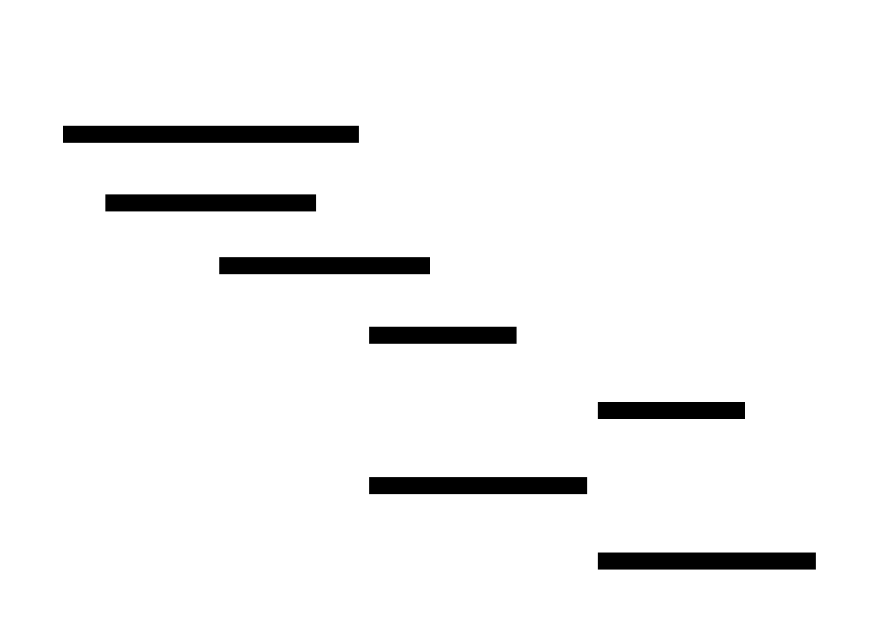
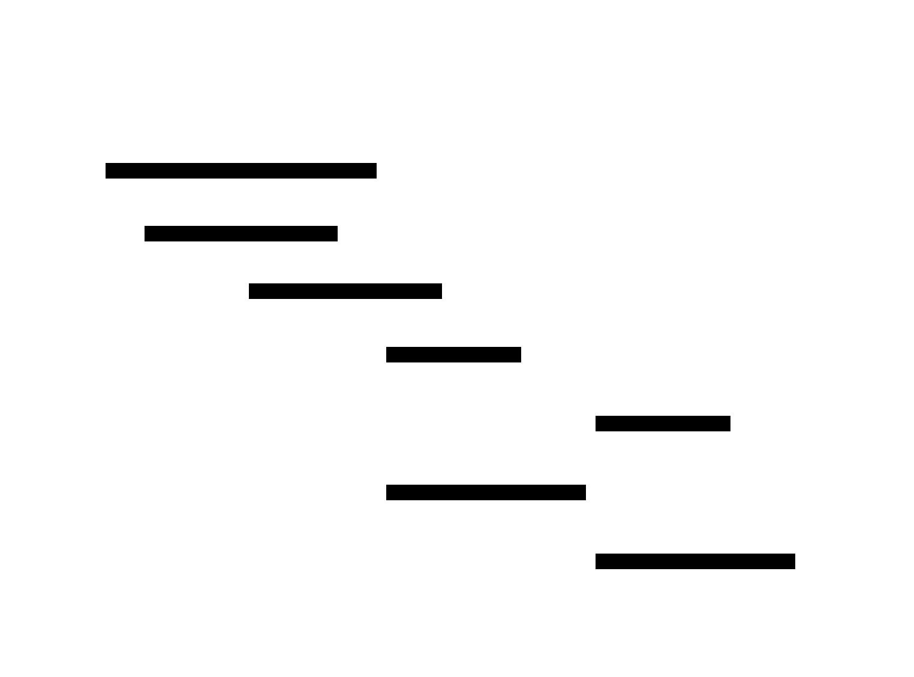
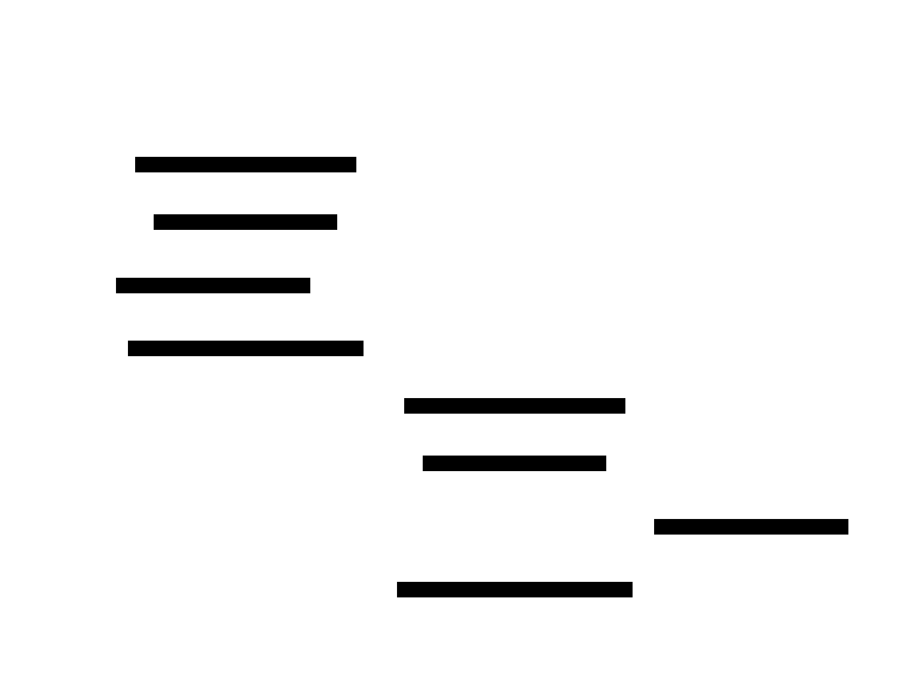

The examples below are taken from the `examples/` directory in the [NIXL repository](https://github.com/ai-dynamo/nixl), annotated with inline explanations. For the conceptual overview of NIXL's transfer workflow, see [Quick Start](../getting-started/quick-start).

**What you'll learn:** How to use etcd for automatic distributed metadata exchange between Transfer Agents, eliminating the need for manual side-channel metadata serialization.

When etcd is configured, agents publish their metadata (connection info and registered memory descriptors) to an etcd server and discover remote agents by name. This replaces the manual `getLocalMD`/`loadRemoteMD` exchange shown in the basic transfer example, making it suitable for production deployments with many agents.

The five phases below -- initialization, publish, fetch, transfer, and invalidation -- cover the complete etcd metadata exchange lifecycle. Each phase includes a sequence diagram followed by a code walkthrough.

### Initialization

<div className="diagram-light">
<Frame caption="Phase 1: Initialization">

</Frame>
</div>
<div className="diagram-dark">
<Frame caption="Phase 1: Initialization">

</Frame>
</div>

The `NIXL_ETCD_ENDPOINTS` environment variable enables etcd mode -- no code changes needed. Both agents are created with UCX backends and register DRAM memory, identical to the non-etcd workflow.

### Publish Metadata to etcd

<div className="diagram-light">
<Frame caption="Phase 2: Publish Metadata">

</Frame>
</div>
<div className="diagram-dark">
<Frame caption="Phase 2: Publish Metadata">

</Frame>
</div>

Each agent serializes its memory descriptors and UCX connection info, then publishes the blob to etcd under `/nixl/agents/<name>/metadata`. No IP/port arguments are needed -- the absence of address arguments signals etcd mode.

### Fetch & Discover from etcd

<div className="diagram-light">
<Frame caption="Phase 3: Fetch & Discover">

</Frame>
</div>
<div className="diagram-dark">
<Frame caption="Phase 3: Fetch & Discover">

</Frame>
</div>

Each agent fetches the other's metadata from etcd by name. The metadata is loaded into local remote sections for transfer use. NIXL automatically creates a persistent watcher on the remote agent's etcd key to detect disconnections.

### Transfer

<div className="diagram-light">
<Frame caption="Phase 4: Transfer">

</Frame>
</div>
<div className="diagram-dark">
<Frame caption="Phase 4: Transfer">

</Frame>
</div>

The transfer is identical to the non-etcd workflow -- etcd is only used for metadata exchange. The cached metadata enables direct RDMA transfers between agents.

### Invalidation & Teardown

<div className="diagram-light">
<Frame caption="Phase 5: Invalidation & Teardown">

</Frame>
</div>
<div className="diagram-dark">
<Frame caption="Phase 5: Invalidation & Teardown">

</Frame>
</div>

When an agent goes offline, `invalidateLocalMD()` deletes its etcd key. This triggers a DELETE event on watchers, causing remote agents to automatically discard cached metadata.

### Code

<CodeBlocks>
```cpp title="C++"
#include <iostream>
#include <thread>
#include <chrono>
#include <cstring>
#include "nixl.h"

int main() {
    // Step 1: Configure etcd endpoint
    // NIXL reads NIXL_ETCD_ENDPOINTS from the environment.
    // If not set, configure it programmatically.
    if (!getenv("NIXL_ETCD_ENDPOINTS")) {
        setenv("NIXL_ETCD_ENDPOINTS", "http://localhost:2379", 1);
    }

    // Step 2: Create agents -- configuration is the same as without etcd
    nixlAgentConfig cfg;
    cfg.useProgThread = true;

    nixlAgent A1("EtcdAgent1", cfg);
    nixlAgent A2("EtcdAgent2", cfg);

    // Step 3: Create UCX backends and register memory
    nixl_b_params_t init1, init2;
    nixl_mem_list_t mems1, mems2;

    A1.getPluginParams("UCX", mems1, init1);
    A2.getPluginParams("UCX", mems2, init2);

    nixlBackendH *ucx1, *ucx2;
    A1.createBackend("UCX", init1, ucx1);
    A2.createBackend("UCX", init2, ucx2);

    nixl_opt_args_t extra_params1, extra_params2;
    extra_params1.backends.push_back(ucx1);
    extra_params2.backends.push_back(ucx2);

    // Allocate and register memory buffers
    nixl_reg_dlist_t dlist1(DRAM_SEG), dlist2(DRAM_SEG);
    size_t buffer_size = 1024;

    void* addr1 = malloc(buffer_size);
    void* addr2 = malloc(buffer_size);
    memset(addr1, 0xaa, buffer_size);
    memset(addr2, 0xbb, buffer_size);

    nixlBlobDesc desc1, desc2;
    desc1.addr = (uintptr_t)addr1;
    desc1.len = buffer_size;
    desc1.devId = 0;
    dlist1.addDesc(desc1);

    desc2.addr = (uintptr_t)addr2;
    desc2.len = buffer_size;
    desc2.devId = 0;
    dlist2.addDesc(desc2);

    A1.registerMem(dlist1, &extra_params1);
    A2.registerMem(dlist2, &extra_params2);

    // Step 4: Publish metadata to etcd
    // sendLocalMD() publishes this agent's metadata to the etcd server.
    // Remote agents can then discover it by name.
    A1.sendLocalMD();
    A2.sendLocalMD();

    // Allow time for etcd to process the metadata
    std::this_thread::sleep_for(std::chrono::seconds(5));

    // Step 5: Fetch remote metadata from etcd
    // fetchRemoteMD() retrieves the named agent's metadata from etcd.
    // No manual serialization or side-channel needed.
    A1.fetchRemoteMD("EtcdAgent2");
    A2.fetchRemoteMD("EtcdAgent1");

    // Step 6: Execute a transfer (same as non-etcd workflow)
    size_t req_size = 8;

    nixl_xfer_dlist_t src_descs(DRAM_SEG);
    nixlBasicDesc src;
    src.addr = (uintptr_t)(((char*)addr1) + 16);
    src.len = req_size;
    src.devId = 0;
    src_descs.addDesc(src);

    nixl_xfer_dlist_t dst_descs(DRAM_SEG);
    nixlBasicDesc dst_desc;
    dst_desc.addr = (uintptr_t)(((char*)addr2) + 8);
    dst_desc.len = req_size;
    dst_desc.devId = 0;
    dst_descs.addDesc(dst_desc);

    nixlXferReqH *req_handle;
    extra_params1.notif = "notification";

    A1.createXferReq(NIXL_WRITE, src_descs, dst_descs,
                     "EtcdAgent2", req_handle, &extra_params1);

    nixl_status_t status = A1.postXferReq(req_handle);

    // Step 7: Wait for completion
    nixl_notifs_t notif_map;
    int n_notifs = 0;

    while (status != NIXL_SUCCESS || n_notifs == 0) {
        if (status != NIXL_SUCCESS)
            status = A1.getXferStatus(req_handle);
        if (n_notifs == 0)
            A2.getNotifs(notif_map);
        n_notifs = notif_map.size();
    }

    std::cout << "Transfer verified" << std::endl;

    // Step 8: Clean up
    A1.releaseXferReq(req_handle);
    A1.deregisterMem(dlist1, &extra_params1);
    A2.deregisterMem(dlist2, &extra_params2);

    // Invalidate metadata in etcd so other agents know we're gone
    A1.invalidateLocalMD();

    free(addr1);
    free(addr2);

    std::cout << "Example completed." << std::endl;
}
```

```python title="Python"
# The Python basic_two_peers.py example works with etcd when the
# NIXL_ETCD_ENDPOINTS environment variable is set. The Python bindings
# handle etcd metadata exchange transparently -- no code changes needed.
#
# To run the basic transfer example with etcd:

# Terminal 1 (target):
# NIXL_ETCD_ENDPOINTS=http://localhost:2379 \
#   python basic_two_peers.py --mode target --ip 127.0.0.1

# Terminal 2 (initiator):
# NIXL_ETCD_ENDPOINTS=http://localhost:2379 \
#   python basic_two_peers.py --mode initiator --ip 127.0.0.1

# When NIXL_ETCD_ENDPOINTS is set, the agent automatically publishes
# metadata to etcd and fetches remote metadata from etcd instead of
# using direct TCP connections for metadata exchange.
```
</CodeBlocks>

<Note>
No Rust etcd example is currently available. The Rust bindings support etcd when `NIXL_ETCD_ENDPOINTS` is set in the environment, following the same transparent behavior as Python.
</Note>

**Expected output:**

```
NIXL Etcd Metadata Example
==========================

1. Sending local metadata to etcd...

2. Fetching remote metadata from etcd...
Transfer verified

Example completed.
```

<Tip>
For full etcd setup instructions including server deployment, namespace configuration, and connection tuning, see [Metadata Exchange with etcd](../user-guide/etcd-metadata-exchange).
</Tip>
