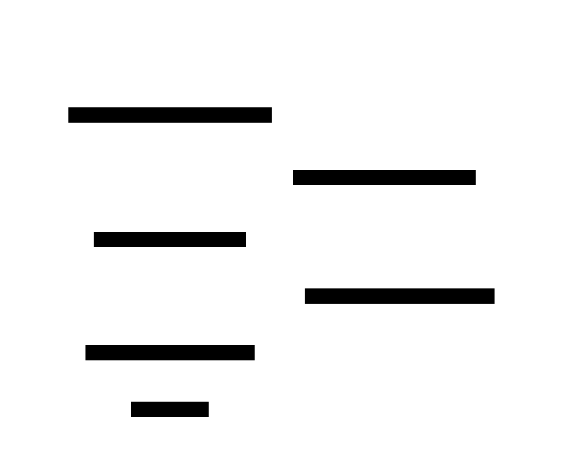
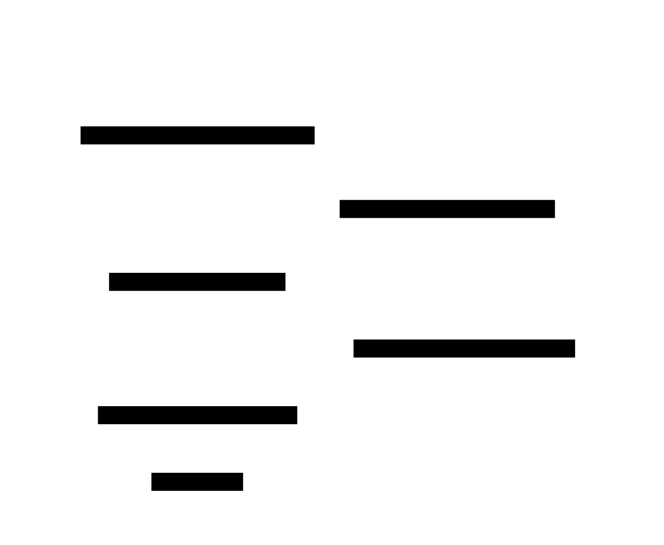

This example is taken from the `examples/` directory in the [NIXL repository](https://github.com/ai-dynamo/nixl), annotated with inline explanations.

**What you'll learn:** How to use NIXL's GPUDirect Storage (GDS) backend to transfer data directly between GPU memory and file storage, bypassing the CPU.

This example demonstrates writing data from a DRAM buffer to a file using the GDS backend, then reading it back into a second buffer for verification. GDS enables direct data paths between storage and memory, reducing CPU overhead for large data transfers.

The four phases below -- initialization, write transfer, read transfer, and verification -- cover the complete GDS direct storage lifecycle. Each phase includes a sequence diagram followed by a code walkthrough.

### Initialization

<div className="diagram-light">
<Frame caption="Phase 1: Initialization">

</Frame>
</div>
<div className="diagram-dark">
<Frame caption="Phase 1: Initialization">

</Frame>
</div>

A single agent is created with the GDS backend. Two DRAM buffers are allocated -- buf1 filled with a 0xba test pattern, buf2 left empty for read-back. Both DRAM buffers and a file descriptor are registered with NIXL.

### Write Transfer (DRAM to File)

<div className="diagram-light">
<Frame caption="Phase 2: Write Transfer">

</Frame>
</div>
<div className="diagram-dark">
<Frame caption="Phase 2: Write Transfer">

</Frame>
</div>

A WRITE transfer moves data from DRAM buf1 directly to the file via the GDS backend, bypassing the CPU. The transfer is posted asynchronously and polled for completion.

### Read Transfer (File to DRAM)

<div className="diagram-light">
<Frame caption="Phase 3: Read Transfer">

</Frame>
</div>
<div className="diagram-dark">
<Frame caption="Phase 3: Read Transfer">

</Frame>
</div>

A READ transfer moves data from the file back into DRAM buf2 via GDS. This completes the round-trip needed for verification.

### Verify & Teardown

<div className="diagram-light">
<Frame caption="Phase 4: Verify & Teardown">

</Frame>
</div>
<div className="diagram-dark">
<Frame caption="Phase 4: Verify & Teardown">

</Frame>
</div>

The round-trip transfer is verified by comparing buf1 and buf2 (both should contain the 0xba pattern). Transfer handles are released, memory is deregistered, buffers are freed, and the file is closed.

### Code

```python title="Python"
import os
import nixl._utils as nixl_utils
from nixl._api import nixl_agent, nixl_agent_config

# Step 1: Create an agent and initialize the GDS backend
# The GDS backend must be available (requires cuFile library)
agent_config = nixl_agent_config(backends=[])
agent = nixl_agent("GDSTester", agent_config)

# Verify GDS plugin is available
plugin_list = agent.get_plugin_list()
assert "GDS" in plugin_list, "GDS plugin not available"

agent.create_backend("GDS")

# Step 2: Allocate DRAM buffers
# buf1 holds the source data (filled with 0xba pattern)
# buf2 is the destination for read-back verification
buf_size = 16 * 4096
addr1 = nixl_utils.malloc_passthru(buf_size)
addr2 = nixl_utils.malloc_passthru(buf_size)
nixl_utils.ba_buf(addr1, buf_size)  # Fill buf1 with 0xba

# Step 3: Register DRAM memory regions with the agent
agent_strings = [(addr1, buf_size, 0, "a"), (addr2, buf_size, 0, "b")]
agent_reg_descs = agent.get_reg_descs(agent_strings, "DRAM")

xfer1_descs = agent.get_xfer_descs([(addr1, buf_size, 0)], "DRAM")
xfer2_descs = agent.get_xfer_descs([(addr2, buf_size, 0)], "DRAM")

agent.register_memory(agent_reg_descs)

# Step 4: Register file-backed memory
# Open (or create) a file and register it as a FILE memory region
# The GDS backend handles direct storage I/O
file_path = "/path/to/gds_test_file"
fd = os.open(file_path, os.O_RDWR | os.O_CREAT)

file_list = [(0, buf_size, fd, "b")]
file_descs = agent.register_memory(file_list, "FILE")
xfer_files = file_descs.trim()

# Step 5: Write DRAM buffer to file via GDS
# WRITE transfers data from the first descriptor list to the second
xfer_handle_write = agent.initialize_xfer(
    "WRITE", xfer1_descs, xfer_files, "GDSTester"
)

state = agent.transfer(xfer_handle_write)
while True:
    state = agent.check_xfer_state(xfer_handle_write)
    if state == "ERR":
        raise RuntimeError("Write transfer failed")
    elif state == "DONE":
        break

# Step 6: Read file data back into the second DRAM buffer
# READ transfers data from the file back into DRAM for verification
xfer_handle_read = agent.initialize_xfer(
    "READ", xfer2_descs, xfer_files, "GDSTester"
)

state = agent.transfer(xfer_handle_read)
while True:
    state = agent.check_xfer_state(xfer_handle_read)
    if state == "ERR":
        raise RuntimeError("Read transfer failed")
    elif state == "DONE":
        break

# Step 7: Verify the round-trip transfer
# buf2 should now contain the same 0xba pattern as buf1
nixl_utils.verify_transfer(addr1, addr2, buf_size)

# Step 8: Clean up
agent.release_xfer_handle(xfer_handle_write)
agent.release_xfer_handle(xfer_handle_read)
agent.deregister_memory(agent_reg_descs)
agent.deregister_memory(file_descs)

nixl_utils.free_passthru(addr1)
nixl_utils.free_passthru(addr2)
os.close(fd)
```

<Note>
GDS requires the cuFile library and a supported filesystem (ext4, XFS, or GDS-compatible). Only the Python GDS example is currently available -- no C++ or Rust variants exist.
</Note>

**Expected output:**

```
Initiator done
Initiator done
Test Complete.
```

<Tip>
For `CUFILE_ENV_PATH_JSON` and other GDS configuration, see [Environment Variables](../resources/environment-variables#gds-gpudirect-storage).
</Tip>
