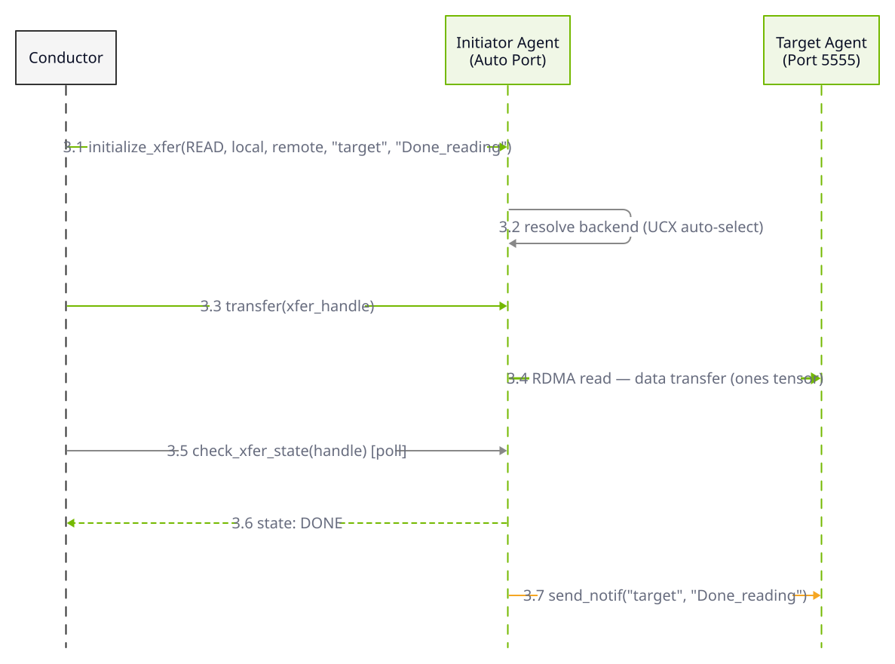
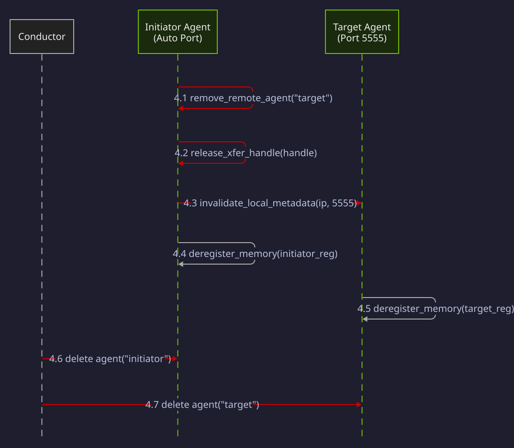

The examples below are taken from the `examples/` directory in the [NIXL repository](https://github.com/ai-dynamo/nixl), annotated with inline explanations. For the conceptual overview of NIXL's transfer workflow, see [Quick Start](/nixl/getting-started/quick-start).

**What you'll learn:** How to create two Transfer Agents, register memory regions, exchange metadata via a side channel, and execute an asynchronous data transfer between them.

This example runs two agents in the same process (or across two processes/machines) and performs a data transfer using the UCX backend. The workflow follows the standard NIXL lifecycle: create agents, register memory, exchange metadata, execute transfer, verify, and tear down.

The four phases below -- initialization, metadata exchange, transfer, and teardown -- cover the complete two-peer transfer lifecycle. Each phase includes a sequence diagram followed by a code walkthrough.

## Initialization

<div className="diagram-light sequence-diagram">
<Frame caption="Phase 1: Initialization">

</Frame>
</div>
<div className="diagram-dark sequence-diagram">
<Frame caption="Phase 1: Initialization">

</Frame>
</div>

Both agents are created with configuration for progress threads and notifications. The target holds source data (ones), while the initiator starts empty (zeros). Both register their memory regions with NIXL so the UCX backend can pin them for RDMA.

### Metadata & Descriptor Exchange

<div className="diagram-light sequence-diagram">
<Frame caption="Phase 2: Metadata & Descriptor Exchange">

</Frame>
</div>
<div className="diagram-dark sequence-diagram">
<Frame caption="Phase 2: Metadata & Descriptor Exchange">

</Frame>
</div>

The initiator fetches the target's metadata via direct TCP, then the target serializes its transfer descriptors and sends them to the initiator using NIXL's notification system. The initiator polls for and deserializes the received descriptors.

### Transfer Execution

<div className="diagram-light sequence-diagram">
<Frame caption="Phase 3: Transfer Execution">

</Frame>
</div>
<div className="diagram-dark sequence-diagram">
<Frame caption="Phase 3: Transfer Execution">

</Frame>
</div>

The initiator creates a READ transfer request to pull data from the target's tensor. The transfer is posted asynchronously and the initiator polls for completion. On success, a "Done_reading" notification is sent to the target.

### Teardown

<div className="diagram-light sequence-diagram">
<Frame caption="Phase 4: Teardown">

</Frame>
</div>
<div className="diagram-dark sequence-diagram">
<Frame caption="Phase 4: Teardown">

</Frame>
</div>

The initiator removes the remote agent reference, releases the transfer handle, and invalidates metadata. Both agents deregister their memory regions and are destroyed.

### Code

<CodeBlocks>
<Markdown src="/snippets/generated/examples/basic-two-peers-py.mdx" />

<Markdown src="/snippets/generated/examples/nixl-example-cpp.mdx" />

<Markdown src="/snippets/generated/examples/single-process-example-rs.mdx" />
</CodeBlocks>

**Expected output:**

```text
Transfer verified
Test done
```

<Tip>
For a step-by-step explanation of the NIXL transfer workflow (initialization, registration, metadata exchange, transfer, teardown), see [Quick Start](/nixl/getting-started/quick-start).
</Tip>
