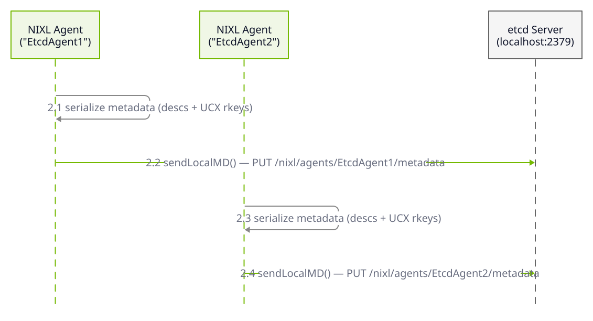
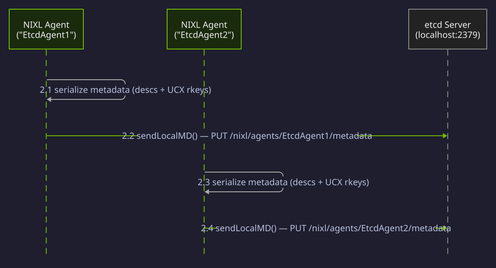
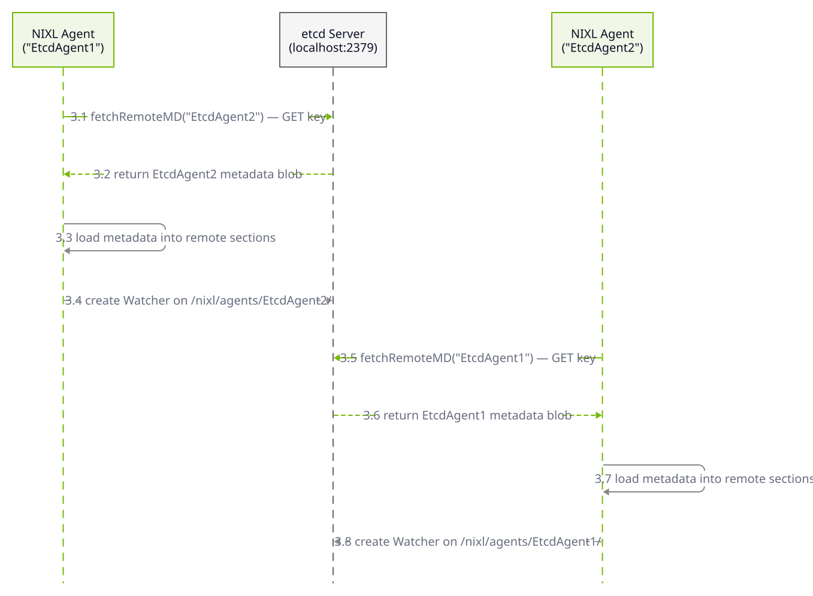
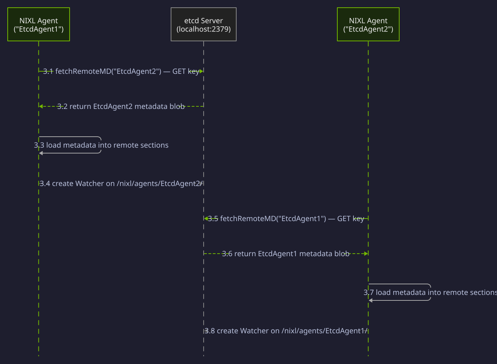
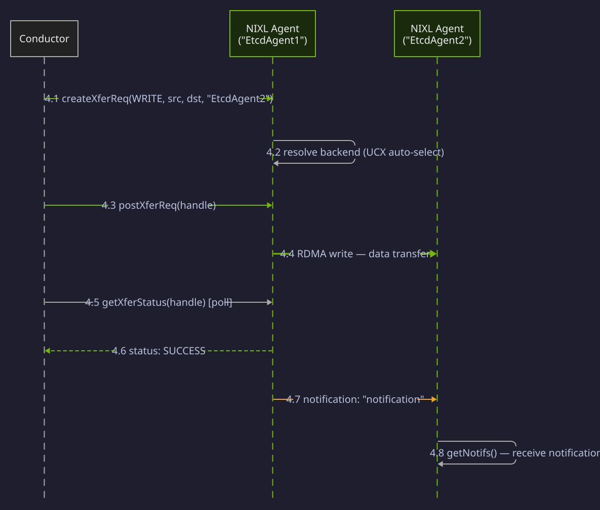

The examples below are taken from the `examples/` directory in the [NIXL repository](https://github.com/ai-dynamo/nixl), annotated with inline explanations. For the conceptual overview of NIXL's transfer workflow, see [Quick Start](/nixl/getting-started/quick-start).

**What you'll learn:** How to use etcd for automatic distributed metadata exchange between Transfer Agents, eliminating the need for manual side-channel metadata serialization.

When etcd is configured, agents publish their metadata (connection info and registered memory descriptors) to an etcd server and discover remote agents by name. This replaces the manual `getLocalMD`/`loadRemoteMD` exchange shown in the basic transfer example, making it suitable for production deployments with many agents.

The five phases below -- initialization, publish, fetch, transfer, and invalidation -- cover the complete etcd metadata exchange lifecycle. Each phase includes a sequence diagram followed by a code walkthrough.

## Initialization

<div className="diagram-light sequence-diagram">
<Frame caption="Phase 1: Initialization">

</Frame>
</div>
<div className="diagram-dark sequence-diagram">
<Frame caption="Phase 1: Initialization">

</Frame>
</div>

The `NIXL_ETCD_ENDPOINTS` environment variable enables etcd mode -- no code changes needed. Both agents are created with UCX backends and register DRAM memory, identical to the non-etcd workflow.

### Publish Metadata to etcd

<div className="diagram-light sequence-diagram">
<Frame caption="Phase 2: Publish Metadata">

</Frame>
</div>
<div className="diagram-dark sequence-diagram">
<Frame caption="Phase 2: Publish Metadata">

</Frame>
</div>

Each agent serializes its memory descriptors and UCX connection info, then publishes the blob to etcd under `/nixl/agents/<name>/metadata`. No IP/port arguments are needed -- the absence of address arguments signals etcd mode.

### Fetch & Discover from etcd

<div className="diagram-light sequence-diagram">
<Frame caption="Phase 3: Fetch & Discover">

</Frame>
</div>
<div className="diagram-dark sequence-diagram">
<Frame caption="Phase 3: Fetch & Discover">

</Frame>
</div>

Each agent fetches the other's metadata from etcd by name. The metadata is loaded into local remote sections for transfer use. NIXL automatically creates a persistent watcher on the remote agent's etcd key to detect disconnections.

### Transfer

<div className="diagram-light sequence-diagram">
<Frame caption="Phase 4: Transfer">

</Frame>
</div>
<div className="diagram-dark sequence-diagram">
<Frame caption="Phase 4: Transfer">

</Frame>
</div>

The transfer is identical to the non-etcd workflow -- etcd is only used for metadata exchange. The cached metadata enables direct RDMA transfers between agents.

### Invalidation & Teardown

<div className="diagram-light sequence-diagram">
<Frame caption="Phase 5: Invalidation & Teardown">

</Frame>
</div>
<div className="diagram-dark sequence-diagram">
<Frame caption="Phase 5: Invalidation & Teardown">

</Frame>
</div>

When an agent goes offline, `invalidateLocalMD()` deletes its etcd key. This triggers a DELETE event on watchers, causing remote agents to automatically discard cached metadata.

### Code

<CodeBlocks>
<Markdown src="/snippets/generated/examples/nixl-etcd-example-cpp.mdx" />

```python title="Python"
# The Python basic_two_peers.py example works with etcd when the
# NIXL_ETCD_ENDPOINTS environment variable is set. The Python bindings
# handle etcd metadata exchange transparently -- no code changes needed.
#
# To run the basic transfer example with etcd:

# Terminal 1 (target):
# NIXL_ETCD_ENDPOINTS=http://localhost:2379 \
#   python basic_two_peers.py --mode target --ip 127.0.0.1

# Terminal 2 (initiator):
# NIXL_ETCD_ENDPOINTS=http://localhost:2379 \
#   python basic_two_peers.py --mode initiator --ip 127.0.0.1

# When NIXL_ETCD_ENDPOINTS is set, the agent automatically publishes
# metadata to etcd and fetches remote metadata from etcd instead of
# using direct TCP connections for metadata exchange.
```

</CodeBlocks>

<Note>
No Rust etcd example is currently available. The Rust bindings support etcd when `NIXL_ETCD_ENDPOINTS` is set in the environment, following the same transparent behavior as Python.
</Note>

**Expected output:**

```text
NIXL Etcd Metadata Example
==========================

1. Sending local metadata to etcd...

2. Fetching remote metadata from etcd...
Transfer verified

Example completed.
```

<Tip>
For full etcd setup instructions including server deployment, namespace configuration, and connection tuning, see [Metadata Exchange with etcd](/nixl/user-guide/metadata-exchange-with-etcd).
</Tip>
