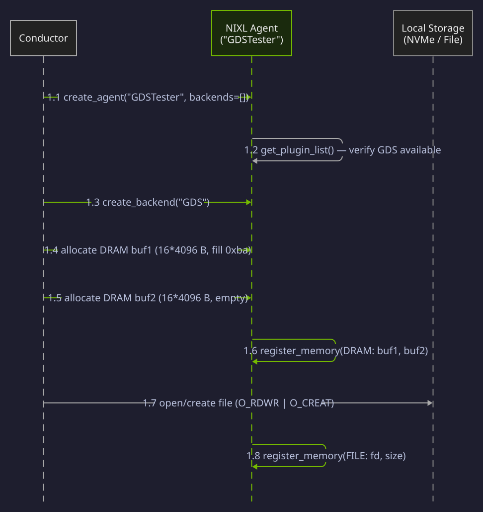
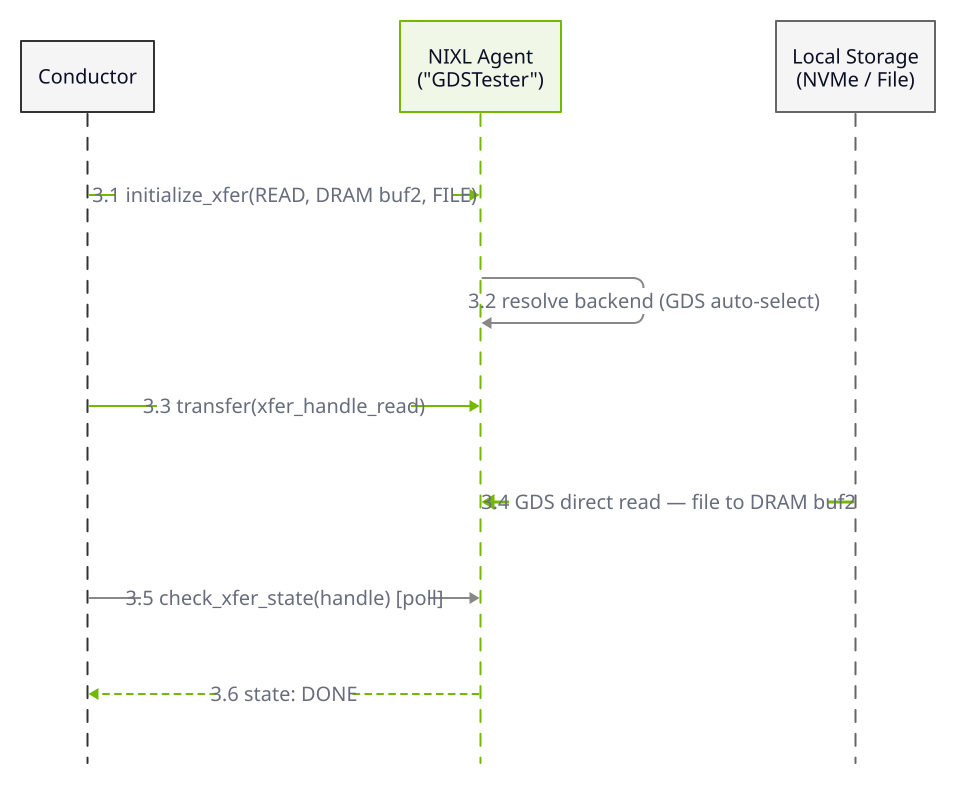

This example is taken from the `examples/` directory in the [NIXL repository](https://github.com/ai-dynamo/nixl), annotated with inline explanations.

**What you'll learn:** How to transfer data between DRAM buffers and file storage using NIXL's GDS backend and apply the same workflow to VRAM buffers.

This example demonstrates writing data from a DRAM buffer to a file using the GDS backend, then reading it back into a second buffer for verification. GDS enables direct data paths between storage and memory, reducing CPU overhead for large data transfers.

The four phases below -- initialization, write transfer, read transfer, and verification -- cover the complete GDS direct storage lifecycle. Each phase includes a sequence diagram followed by a code walkthrough.

## Initialization

<div className="diagram-light sequence-diagram">
<Frame caption="Phase 1: Initialization">

</Frame>
</div>
<div className="diagram-dark sequence-diagram">
<Frame caption="Phase 1: Initialization">

</Frame>
</div>

A single agent is created with the GDS backend. Two DRAM buffers are allocated -- buf1 filled with a 0xba test pattern, buf2 left empty for read-back. Both DRAM buffers and a file descriptor are registered with NIXL.

### Write Transfer (DRAM to File)

<div className="diagram-light sequence-diagram">
<Frame caption="Phase 2: Write Transfer">

</Frame>
</div>
<div className="diagram-dark sequence-diagram">
<Frame caption="Phase 2: Write Transfer">

</Frame>
</div>

A WRITE transfer moves data from DRAM buf1 directly to the file via the GDS backend, bypassing the CPU. The transfer is posted asynchronously and polled for completion.

### Read Transfer (File to DRAM)

<div className="diagram-light sequence-diagram">
<Frame caption="Phase 3: Read Transfer">

</Frame>
</div>
<div className="diagram-dark sequence-diagram">
<Frame caption="Phase 3: Read Transfer">

</Frame>
</div>

A READ transfer moves data from the file back into DRAM buf2 via GDS. This completes the round-trip needed for verification.

### Verify & Teardown

<div className="diagram-light sequence-diagram">
<Frame caption="Phase 4: Verify & Teardown">

</Frame>
</div>
<div className="diagram-dark sequence-diagram">
<Frame caption="Phase 4: Verify & Teardown">

</Frame>
</div>

The round-trip transfer is verified by comparing buf1 and buf2 (both should contain the 0xba pattern). Transfer handles are released, memory is deregistered, buffers are freed, and the file is closed.

### Code

<Markdown src="/snippets/generated/examples/nixl-gds-example-py.mdx" />

<Note>
GDS requires the cuFile library and a supported filesystem (ext4, XFS, or GDS-compatible). Only the Python GDS example is currently available -- no C++ or Rust variants exist.
</Note>

**Expected output:**

```text
Initiator done
Initiator done
Test Complete.
```

<Tip>
For `CUFILE_ENV_PATH_JSON` and other GDS configuration, see [Environment Variables](/nixl/resources/environment-variables#gds-gpudirect-storage).
</Tip>
