This example demonstrates a high-performance storage transfer system built on NIXL that supports both local and remote storage operations. It uses POSIX and GDS (GPUDirect Storage) backends with UCX-based networking. Source: [`examples/python/remote_storage_example/`](https://github.com/ai-dynamo/nixl/tree/main/examples/python/remote_storage_example)

## Features

- **Flexible Storage Backends**: GDS for high-performance, POSIX fallback, automatic selection
- **Transfer Modes**: Local and remote memory-to-storage, bidirectional READ/WRITE, batch processing
- **Network Communication**: UCX-based data transfer, metadata exchange, async notifications

## Overview

The system operates in two modes. The **server** waits for requests from clients to READ/WRITE from its storage to a remote node. The **client** initiates transfers and performs both local and remote operations with storage servers.

The four phases below -- initialization, metadata exchange, remote write, and remote read -- cover the complete remote storage transfer lifecycle. Each phase includes a sequence diagram followed by a code walkthrough.

<Info>
In production, initialization and metadata exchange happen once at startup. Only the transfer phases (write/read) repeat per request.
</Info>

### Initialization

<div className="diagram-light sequence-diagram">
<Frame caption="Phase 1: Initialization">
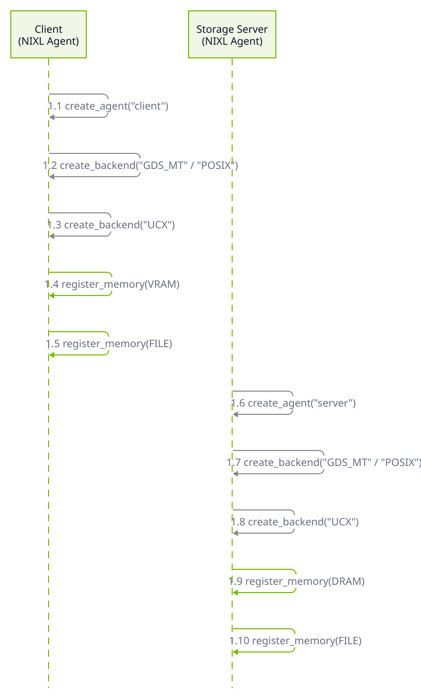
</Frame>
</div>
<div className="diagram-dark sequence-diagram">
<Frame caption="Phase 1: Initialization">
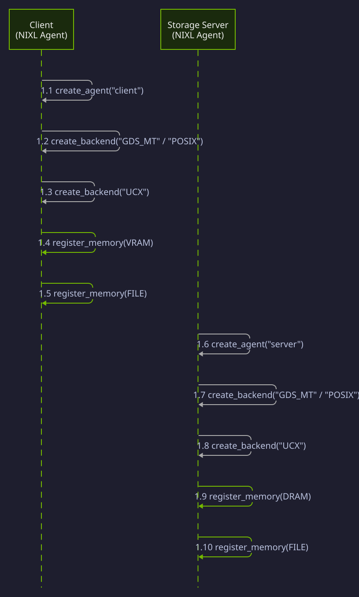
</Frame>
</div>

Both nodes create a NIXL agent, register storage backends (GDS_MT preferred, POSIX fallback), and register a UCX backend for network transfers. The client registers VRAM segments (GPU memory) and file descriptors. The server registers DRAM segments and file descriptors.

<Markdown src="/snippets/generated/examples/common/create-agent-with-plugins.mdx" />

<Markdown src="/snippets/generated/examples/common/setup-memory-and-files.mdx" />

### Metadata Exchange

<div className="diagram-light sequence-diagram">
<Frame caption="Phase 2: Metadata Exchange">
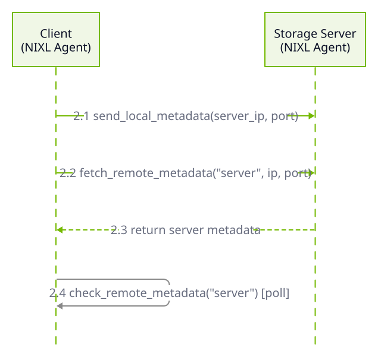
</Frame>
</div>
<div className="diagram-dark sequence-diagram">
<Frame caption="Phase 2: Metadata Exchange">
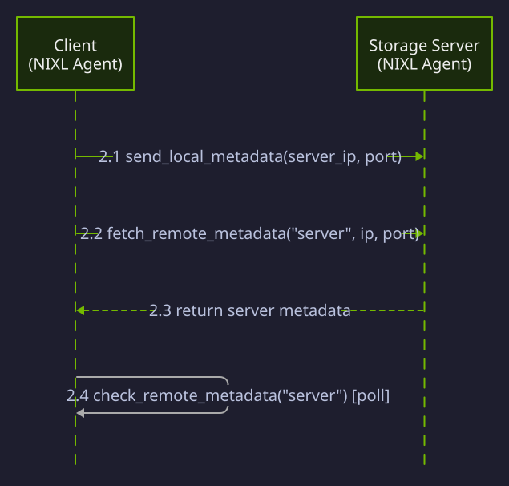
</Frame>
</div>

The client reads a list of storage servers from a file and connects to each one. For each server, the client publishes its own metadata and fetches the server's metadata, then polls until the exchange completes.

<Markdown src="/snippets/generated/examples/nixl-p2p-storage-example/connect-to-agents.mdx" />

### Remote Write Request

<div className="diagram-light sequence-diagram">
<Frame caption="Phase 3: Remote Write Request">
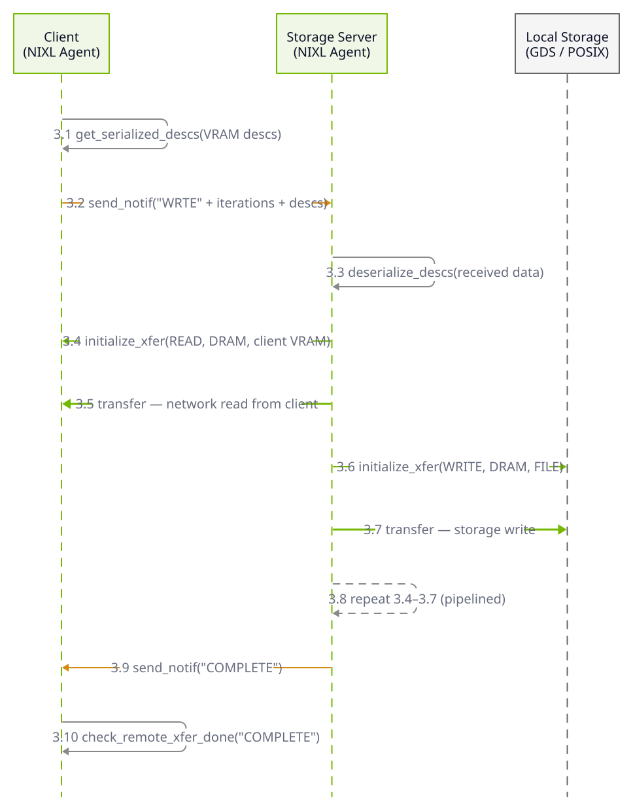
</Frame>
</div>
<div className="diagram-dark sequence-diagram">
<Frame caption="Phase 3: Remote Write Request">
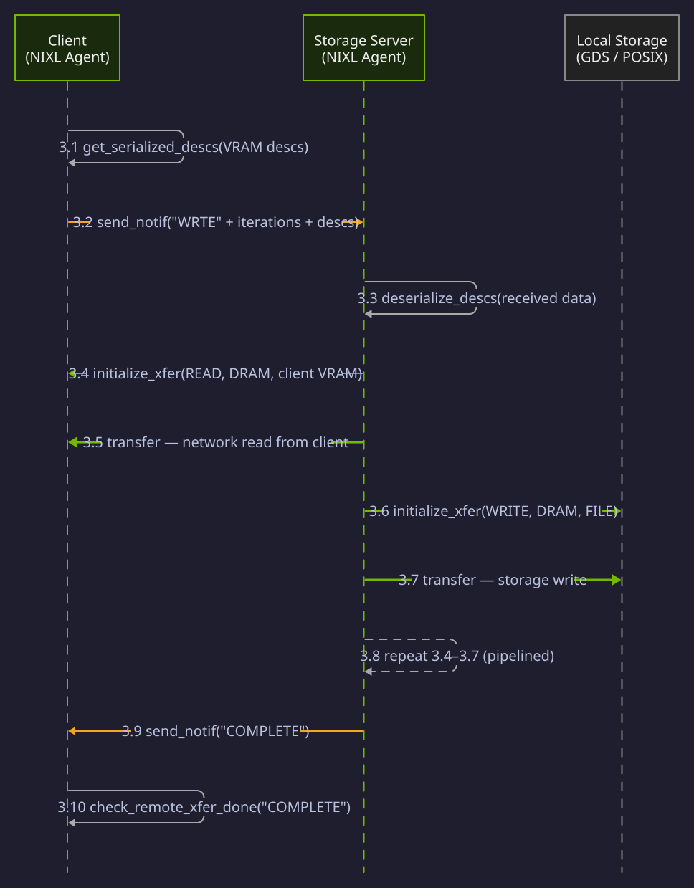
</Frame>
</div>

The client serializes its VRAM descriptors and sends a `WRTE` notification to the server. The server deserializes the descriptors and executes a pipelined loop: **network read** (UCX read from client VRAM into server DRAM) followed by **storage write** (GDS/POSIX write from DRAM to local file). These two operations overlap across iterations for throughput. On completion, the server sends a `COMPLETE` notification back.

<Markdown src="/snippets/generated/examples/nixl-p2p-storage-example/remote-storage-transfer.mdx" />

<Markdown src="/snippets/generated/examples/nixl-p2p-storage-example/execute-transfer.mdx" />

<Markdown src="/snippets/generated/examples/nixl-p2p-storage-example/pipeline-writes.mdx" />

### Remote Read Request

<div className="diagram-light sequence-diagram">
<Frame caption="Phase 4: Remote Read Request">
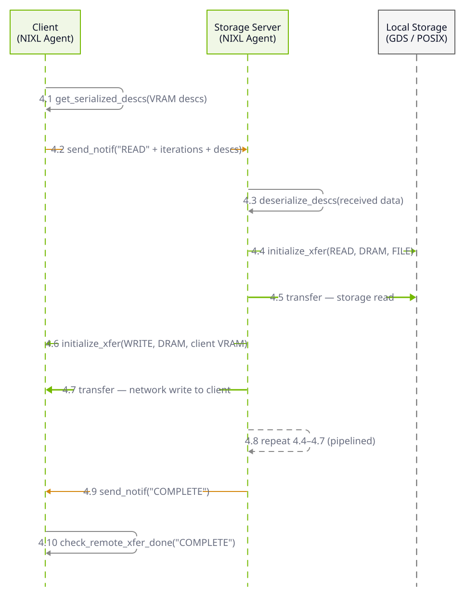
</Frame>
</div>
<div className="diagram-dark sequence-diagram">
<Frame caption="Phase 4: Remote Read Request">
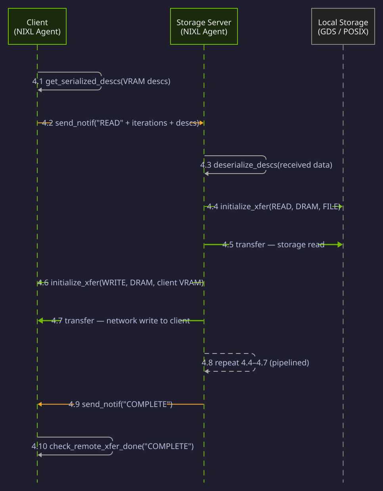
</Frame>
</div>

The client sends a `READ` notification to the server. The server executes the reverse pipeline: **storage read** (GDS/POSIX read from local file into server DRAM) followed by **network write** (UCX write from server DRAM to client VRAM). Again, operations overlap across iterations. On completion, the server notifies the client.

<Markdown src="/snippets/generated/examples/nixl-p2p-storage-example/remote-storage-transfer.mdx" />

<Markdown src="/snippets/generated/examples/nixl-p2p-storage-example/execute-transfer.mdx" />

<Markdown src="/snippets/generated/examples/nixl-p2p-storage-example/pipeline-reads.mdx" />

### Pipelining

To improve throughput, the server pipelines storage and network operations across iterations. While one iteration's network transfer is in flight, the next iteration's storage operation begins concurrently using a thread pool.

#### Read Pipeline (Storage Read → Network Write)

<div className="diagram-light sequence-diagram">
<Frame caption="Read Pipeline: storage read overlaps with previous network write">
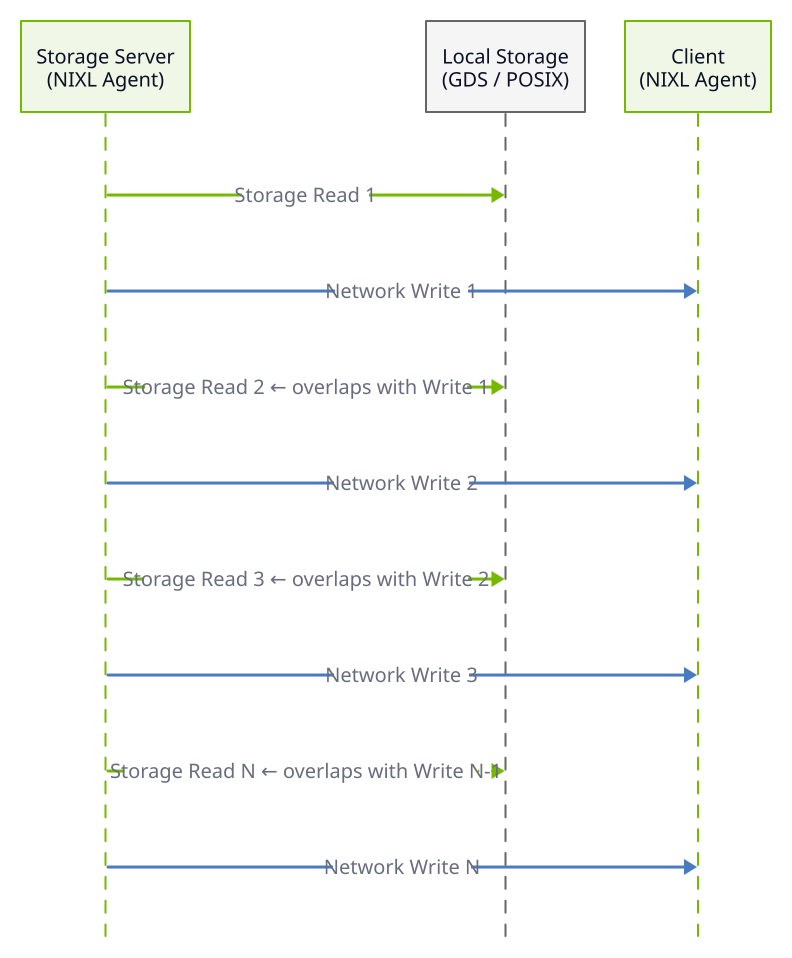
</Frame>
</div>
<div className="diagram-dark sequence-diagram">
<Frame caption="Read Pipeline: storage read overlaps with previous network write">
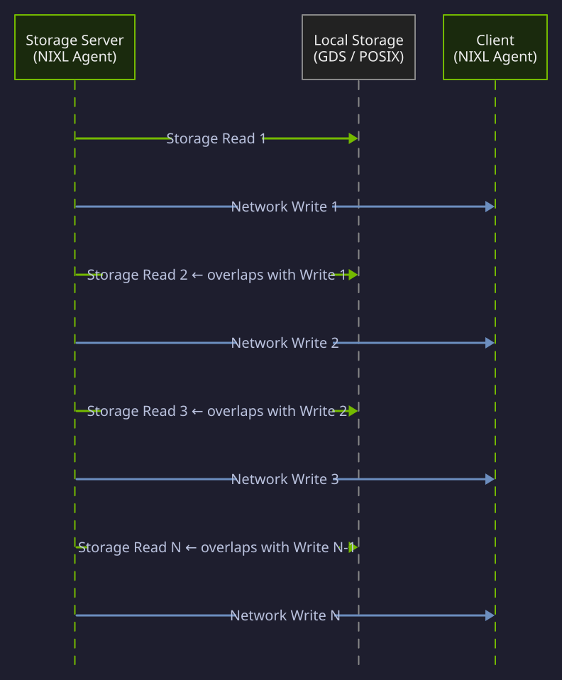
</Frame>
</div>

#### Write Pipeline (Network Read → Storage Write)

<div className="diagram-light sequence-diagram">
<Frame caption="Write Pipeline: network read overlaps with previous storage write">
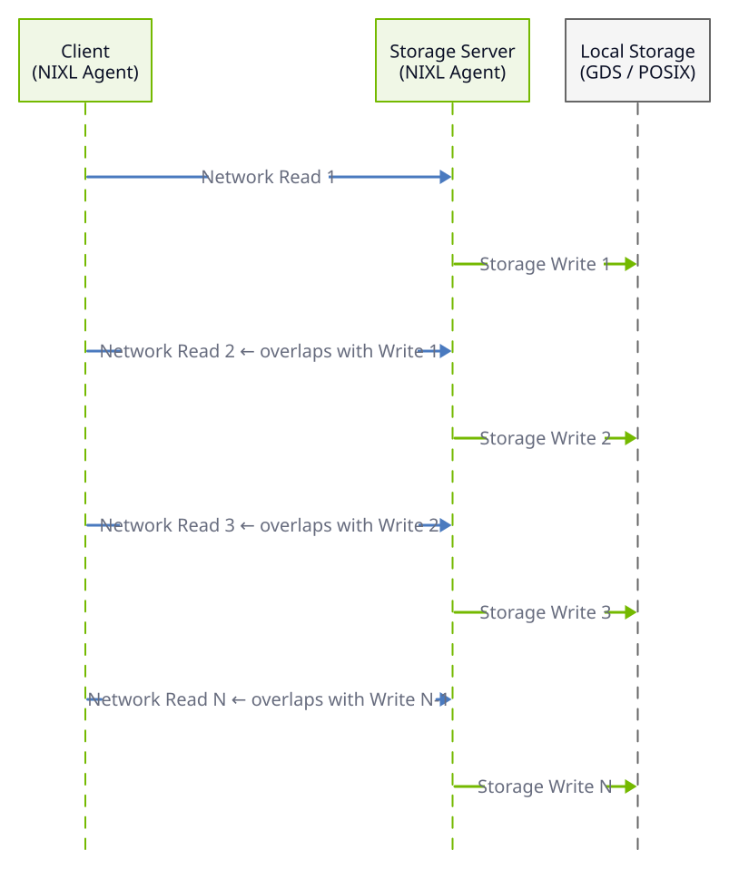
</Frame>
</div>
<div className="diagram-dark sequence-diagram">
<Frame caption="Write Pipeline: network read overlaps with previous storage write">
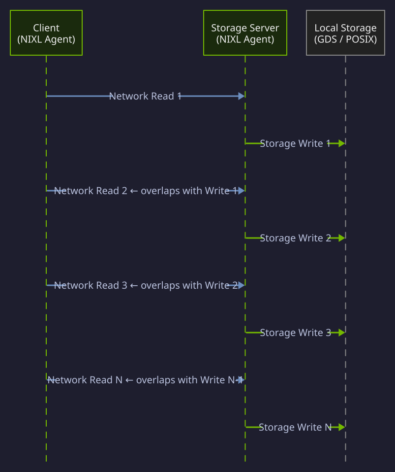
</Frame>
</div>

The pipeline is implemented using a `ThreadPoolExecutor` with two workers -- one for storage and one for network. The first and last iterations are special-cased (no overlap), while middle iterations submit both operations concurrently:

<Markdown src="/snippets/generated/examples/nixl-p2p-storage-example/pipeline-reads.mdx" />

<Markdown src="/snippets/generated/examples/nixl-p2p-storage-example/pipeline-writes.mdx" />

## Usage

### Running as Client

```bash
python nixl_p2p_storage_example.py --role client \
                      --agents_file <file_path> \
                      --fileprefix <path_prefix> \
                      --name <agent_name> \
                      [--buf_size <size>] \
                      [--batch_size <count>]
```

The `--agents_file` is a list of storage servers the client connects to. The file should have agents separated by line, with `<agent_name> <ip_address> <port>` on each line.

The `--fileprefix` specifies a path to run local storage transfers on. The `--name` sets the Transfer Agent name for this client.

### Running as Server

```bash
python nixl_p2p_storage_example.py --role server \
                      --fileprefix <path_prefix> \
                      --name <agent_name> \
                      [--buf_size <size>] \
                      [--batch_size <count>]
```

Server names must match what is listed in the client agents file. The `buf_size` and `batch_size` must match between client and server.

## Requirements

- Python 3.6+
- NIXL library with plug-ins: GDS (optional), POSIX, UCX

## Performance Tips

- For optimal GDS performance, use the GDS_MT backend with default concurrency
- Check that your GDS setup is running true GPU-direct IO (not compatibility mode)
- For network tuning, set `UCX_MAX_RMA_RAILS=1` for VRAM-to-DRAM transfers (may need higher for larger messages)

<Tip>
For GDS configuration details, see [Environment Variables](/nixl/resources/environment-variables#gds-gpudirect-storage). For backend-specific documentation, see [NIXL Backends](/nixl/user-guide/backend-selection).
</Tip>
